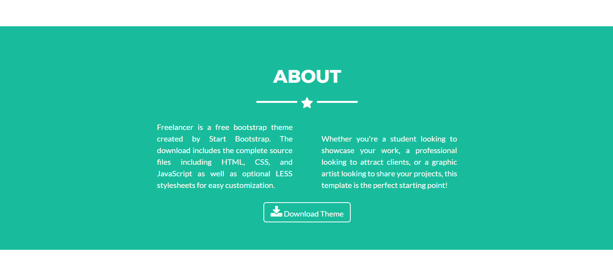
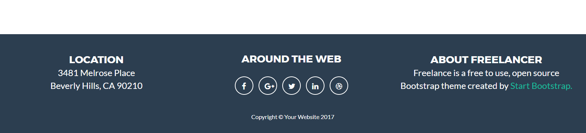

# Freelancer

* **Track:** _Common Core_
* **Curso:** _Creando tu primer sitio web interactivo_
* **Unidad:** _Maquetado web con HTML & CSS_

***

## Herramientas a ultilizar
1. HTML5 *HyperText Markup Language* para maquetar o estructurar nuestra pagina web.
2. CSS3 *Cascading Style Sheets* para dar estilos y poder modificar el flujo de nuestra pagina web.

## Producto final

